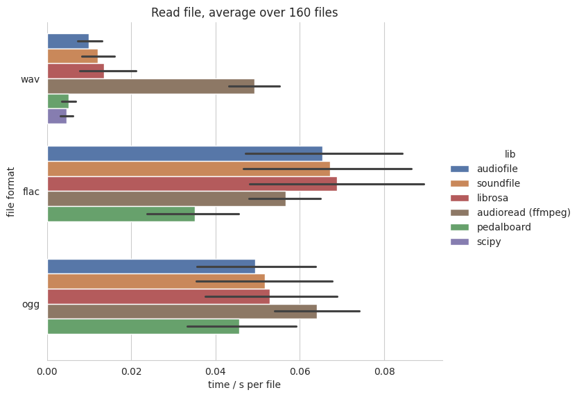
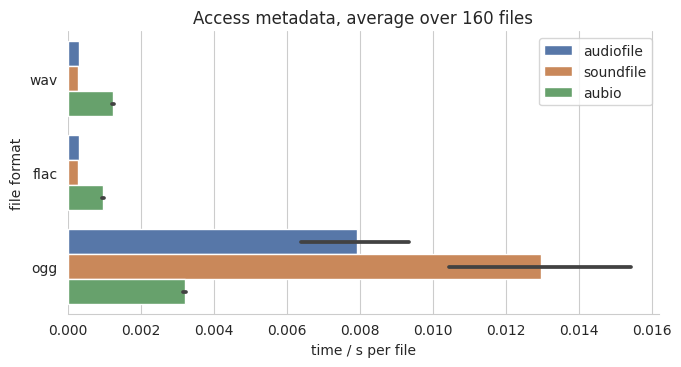
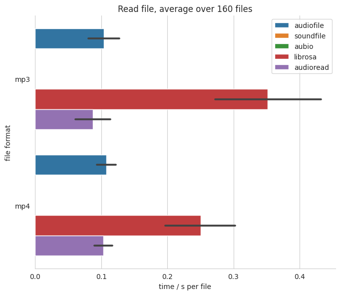
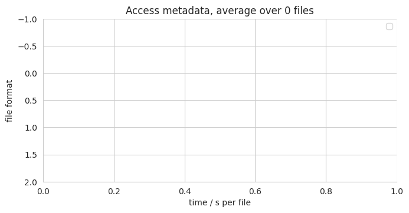

Benchmark
=========

We benchmarked several Python audio reading libraries
against each other.
The procedure follows the `python_audio_loading_benchmark project`_.

Procedure
---------

The benchmark loads 160 single channel audio files
and measures the time until the audio is converted
to a :class:`numpy.array`.

Audio files
^^^^^^^^^^^

All files have a sampling rate of 44100 Hz,
and contain white noise.
They are generated by sox.
They differ in length between 1 second and 151 seconds,
in 10 seconds steps, including 10 files per length.
Leading to an overall of 160 files per audio format.
Starting from the WAV files,
FLAC, OGG, MP3, and MP4 files were generated using ffmpeg_.

Python packages
^^^^^^^^^^^^^^^

The following Python packages are benchmarked against each other:

* aubio_ 0.4.5
* audioread_ 2.1.9
* :mod:`audiofile` 1.1.0
* librosa_ 0.9.1
* scipy_ 1.8.0
* soundfile_ 0.10.3.post1
* sox_ 1.4.1

scipy_ and librosa_ are only tested for reading files,
whereas sox_ is only tested for accessing metadata information.
audioread_ can use three different libraries under the hood:
ffmpeg_, gstreamer_, mad_.
mad_ works only for MP3 files,
and is only benchmarked for those.
As gstreamer_ is slow and complicated to install
it is not included in the benchmarks.

Reading files
^^^^^^^^^^^^^

The benchmark loads the audio files
and measures the time until the audio is converted
to a :class:`numpy.array`.

Accessing metadata
^^^^^^^^^^^^^^^^^^

For benchmark accessing metadata information,
the following was requested for every file:

* channels
* duration
* samples
* sampling rate

Running the benchmark
^^^^^^^^^^^^^^^^^^^^^

The benchmark was executed on the following machine:

* CPU: Intel(R) Core(TM) i7-8750H CPU @ 2.20GHz x 12
* RAM: 15.37 GB
* Hard drive: Samsung SSD 860
* Linux: Ubuntu 18.04.6
* Python: 3.8.13

To rerun the benchmark yourself,
clone the repository
and execute:

.. code-block:: bash

    $ cd docs/benchmark/
    $ bash install_dependencies.sh
    $ bash generate_audio.sh
    $ bash run.sh

This requires that Python 3.8 is installed
and will ask for a sudo password
to install missing apt packages.

WAV, FLAC, OGG
--------------

Reading files
^^^^^^^^^^^^^

audioread_ has been removed from the results
as it was the slowest library.
scipy_ is only meant for reading WAV files,
and only included in this figure.

Results for :mod:`audiofile`, soundfile_ and librosa_ are similar here
as all of them use soundfile_ under the hood to read the data.

Accessing metadata
^^^^^^^^^^^^^^^^^^

audioread_ (ffmpeg) and sox_ have been removed from the results
as they take around 0.17s and 0.035s per file
for WAV, FLAC, and OGG.

MP3, MP4
--------

Reading files
^^^^^^^^^^^^^

soundfile_ does not support
reading MP3 and MP4 files,
audioread_ (mad) only MP3 files.

Accessing metadata
^^^^^^^^^^^^^^^^^^

soundfile_ does not support
accessing MP3 and MP4 metadata.
sox_ and audioread_ (mad) only for MP3 files.

For MP3 and MP4 files,
:mod:`audiofile` is not very fast in accessing the metadata.
The main focus was not speed,
but consistent results for number of samples and duration.
This can only be achieved by first converting the file to WAV
as the duration will depend on the used decoder.
You can speed up the processing by setting ``sloppy=True``
as argument to :func:`audiofile.duration`.
This tries to read the duration from the header of the file
and is shown as audiofile (sloppy)
in the figure.

.. _aubio: https://github.com/aubio/aubio/
.. _audioread: https://github.com/beetbox/audioread/
.. _ffmpeg: https://ffmpeg.org/
.. _gstreamer: https://gstreamer.freedesktop.org/
.. _librosa: https://github.com/librosa/librosa/
.. _mad: https://sourceforge.net/projects/mad/
.. _scipy: https://docs.scipy.org/doc/scipy/reference/generated/scipy.io.wavfile.read.html
.. _soundfile: https://github.com/bastibe/SoundFile/
.. _sox: https://github.com/rabitt/pysox/
.. _python_audio_loading_benchmark project: https://github.com/faroit/python_audio_loading_benchmark
