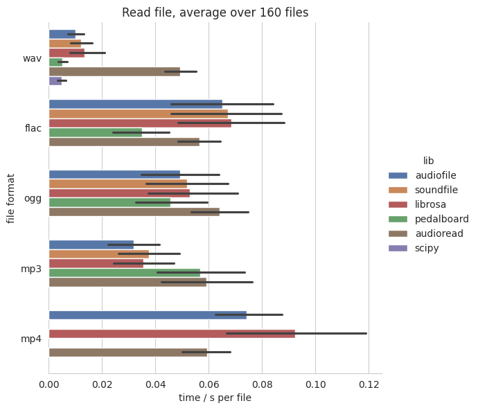
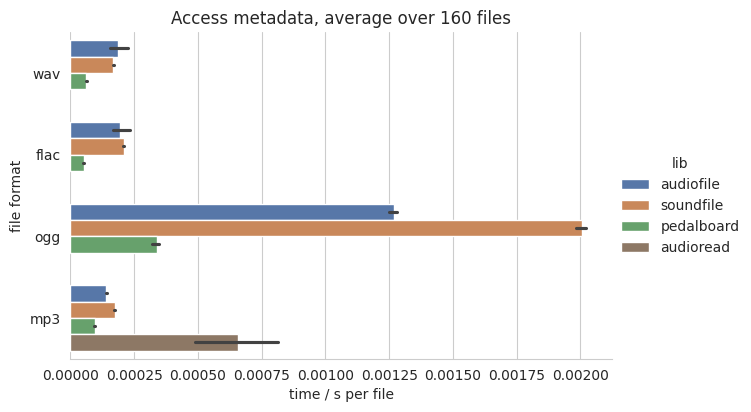
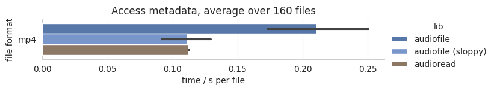

Benchmark
=========

We benchmarked several Python audio reading libraries
against each other.
The procedure follows the `python_audio_loading_benchmark project`_.

Procedure
---------

The benchmark loads 160 single channel audio files
and measures the time until the audio is converted
to a :class:`numpy.array`.

Audio files
^^^^^^^^^^^

All files have a sampling rate of 44100 Hz,
and contain white noise.
They are generated by sox.
They differ in length between 1 second and 151 seconds,
in 10 seconds steps, including 10 files per length.
Leading to an overall of 160 files per audio format.
Starting from the WAV files,
FLAC, OGG, MP3, and MP4 files were generated using ffmpeg_.

Python packages
^^^^^^^^^^^^^^^

The following Python packages are benchmarked against each other:

* audioread_ 3.0.1
* :mod:`audiofile` 1.4.0
* librosa_ 0.10.1
* pedalboard_ 0.8.7
* scipy_ 1.11.4
* soundfile_ 0.12.1
* sox_ 1.4.1

scipy_ and librosa_ are only tested for reading files,
whereas sox_ is only tested for accessing metadata information.
audioread_ can use three different libraries under the hood:
ffmpeg_, gstreamer_, mad_.
mad_ works only for MP3 files,
and is only benchmarked for those.
As gstreamer_ is slow and complicated to install
it is not included in the benchmarks.

Reading files
^^^^^^^^^^^^^

The benchmark loads the audio files
and measures the time until the audio is converted
to a :class:`numpy.array`.

Accessing metadata
^^^^^^^^^^^^^^^^^^

For benchmark accessing metadata information,
the following was requested for every file:

* channels
* duration
* samples
* sampling rate

Running the benchmark
^^^^^^^^^^^^^^^^^^^^^

The benchmark was executed on the following machine:

* CPU: 13th Gen Intel Core i7-1355U, 10-core (2-mt/8-st)
* RAM: 15.29 GiB
* Hard drive: KIOXIA KXG8AZNV1T02
* Linux: Ubuntu 22.04.3
* Python: 3.10.12

To rerun the benchmark yourself,
clone the repository
and execute:

.. code-block:: bash

    $ cd docs/benchmark/
    $ bash install_dependencies.sh
    $ bash generate_audio.sh
    $ bash run.sh

This requires that Python 3.10 is installed
and will ask for a sudo password
to install missing apt packages.

Reading files
-------------

audioread_ uses mad_ when reading MP3 files
and ffmpeg_ in all other cases.
scipy_ is only meant for reading WAV files.

Results for :mod:`audiofile`, soundfile_ and librosa_ are similar
for WAV, FLAC, MP3, OGG
as all of them use soundfile_ under the hood
to read the data.

Accessing metadata
------------------

audioread_ (ffmpeg) and sox_ have been removed from the results
as they take around 0.003s and 0.012s per file.
For MP3 files audioread_ uses the mad_ library.

For MP4 files,
:mod:`audiofile` is not very fast in accessing the metadata.
The main focus was not speed,
but consistent results for number of samples and duration.
This can only be achieved by first converting the file to WAV
as the duration will depend on the used decoder.
You can speed up the processing by setting ``sloppy=True``
as argument to :func:`audiofile.duration`.
This tries to read the duration from the header of the file
and is shown as audiofile (sloppy)
in the figure.
soundfile_ and sox_ do not support
accessing MP4 metadata.
pedalboard_ only on MacOS.

.. _audioread: https://github.com/beetbox/audioread/
.. _ffmpeg: https://ffmpeg.org/
.. _gstreamer: https://gstreamer.freedesktop.org/
.. _librosa: https://github.com/librosa/librosa/
.. _libsndfile: http://www.mega-nerd.com/libsndfile/
.. _mad: https://sourceforge.net/projects/mad/
.. _pedalboard: https://github.com/spotify/pedalboard
.. _scipy: https://docs.scipy.org/doc/scipy/reference/generated/scipy.io.wavfile.read.html
.. _soundfile: https://github.com/bastibe/SoundFile/
.. _sox: https://github.com/rabitt/pysox/
.. _python_audio_loading_benchmark project: https://github.com/faroit/python_audio_loading_benchmark
